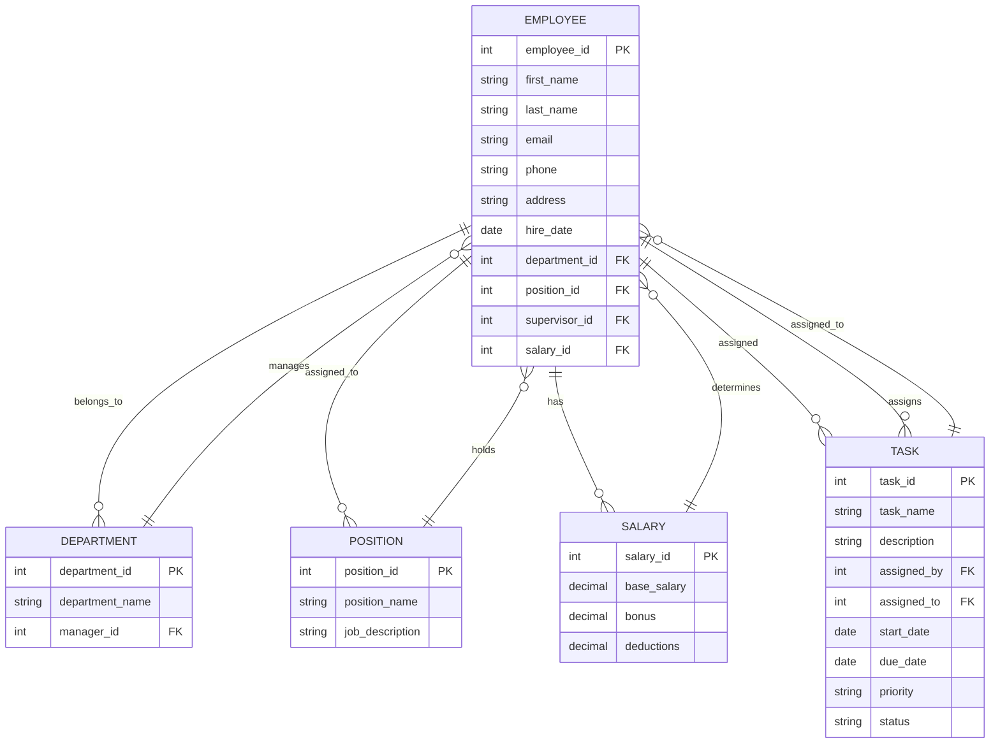

# Logistics Management System

## Entity Relationship Diagram

```mermaid
erDiagram
    EMPLOYEE {
        int employee_id PK
        string first_name
        string last_name
        string email
        string phone
        string address
        date hire_date
        int department_id FK
        int position_id FK
        int supervisor_id FK
        int salary_id FK
    }
    DEPARTMENT {
        int department_id PK
        string department_name
        int manager_id FK
    }
    POSITION {
        int position_id PK
        string position_name
        string job_description
    }
    SALARY {
        int salary_id PK
        decimal base_salary
        decimal bonus
        decimal deductions
    }
    TASK {
        int task_id PK
        string task_name
        string description
        int assigned_by FK
        int assigned_to FK
        date start_date
        date due_date
        string priority
        string status
    }
    EMPLOYEE ||--o{ DEPARTMENT : belongs_to
    EMPLOYEE ||--o{ POSITION : assigned_to
    EMPLOYEE ||--o{ SALARY : has
    EMPLOYEE ||--o{ TASK : assigned
    EMPLOYEE ||--o{ TASK : assigns
    DEPARTMENT ||--o{ EMPLOYEE : manages
    POSITION ||--o{ EMPLOYEE : holds
    SALARY ||--o{ EMPLOYEE : determines
    TASK ||--o{ EMPLOYEE : assigned_to
```
