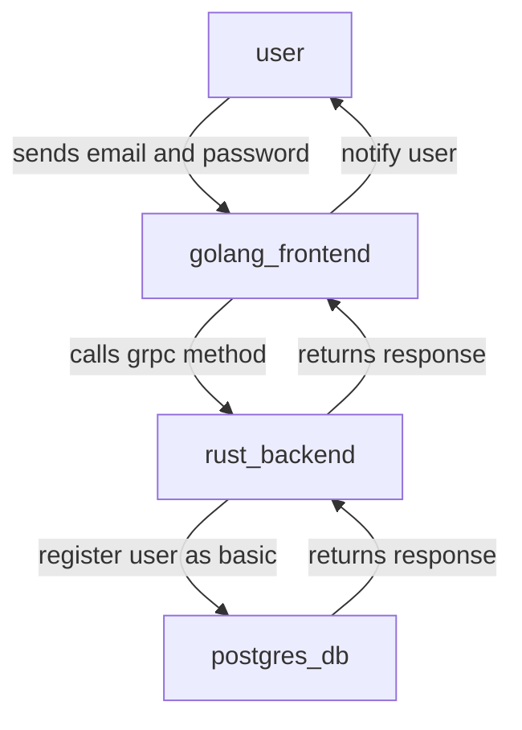
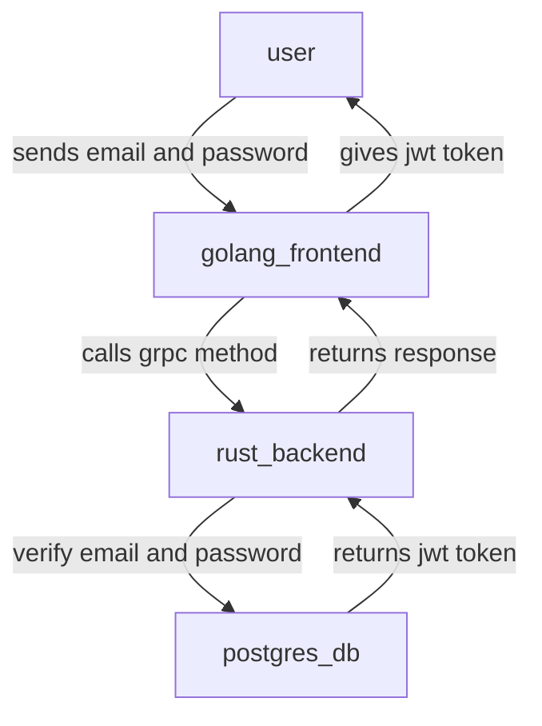
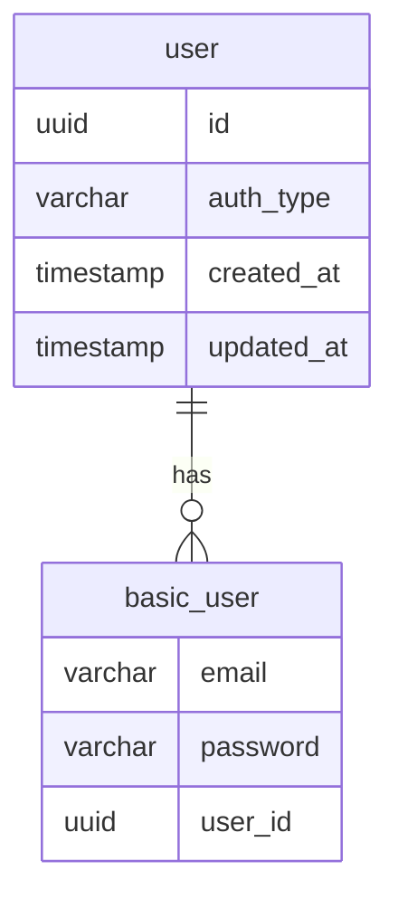

# Authentication Service

## Overview

## User flow

### Register User as Basic (email,password)



### Login User through Basic (email,password)



## Entity Relationship Diagram



## GRPC Schema

```protobuf
syntax = "proto3";

package "auth";

message AuthToken {
  string access_token = 1; 
  string token_type = 2;
  string refresh_token = 3;
  int64 exp = 4;
  repeated string scopes = 5;
}

message AuthBasicLoginRequest {
  string email = 1;
  string password = 2;
}

message AuthRegisterBasicRequest {
  string email = 1;
  string password = 2;
}

service AuthenticationService {
  rpc AuthBasicLogin(AuthBasicLoginRequest) returns (AuthToken) {}
  rpc AuthBasicRegister(AuthRegisterBasicRequest) returns (AuthToken) {}
}
```

## PostgreSQL Schema

### Schema

```sql
-- up
create schema "auth";

-- down
drop schema "auth" cascade;
```

### Table

```sql
-- up
create extension pgcrypto;

create table "auth"."user" (
  id uuid primary key default gen_random_uuid(),
  auth_type varchar not null,
  created_at timestamp not null default current_timestamp
  updated_at timestamp not null default current_timestamp
);

create table "auth"."basic_user" (
  email varchar primary key,
  password varchar not null,
  user_id uuid,
  foreign key (user_id) references "auth"."user"(id) on delete cascade
);

-- down
drop schema "auth"."user" cascade;
drop schema "auth"."basic_user" cascade;
drop extension pgcrypto;
```

### Triggers

```sql
-- up

-- insert trigger function
create function "auth"."insert_basic_user_trigger_fn"() returns trigger as $$
declare 
  new_id uuid;
begin

  -- create a user
  insert into "auth"."user" (auth_type) values ('basic_auth') returning id into new_id;

  new.user_id := new_id;
  new.password := crypt(new.password, gen_salt('bf'));

  return new;
end;
$$ language plpgsql;

-- insert trigger
create trigger "auth_basic_user_before_insert_trigger" before insert on "auth"."basic_user" for each row execute function "auth"."insert_basic_user_trigger_fn"();

-- update trigger function
create function "auth"."update_basic_user_trigger_fn"() returns trigger as $$
begin
  
  -- update the `updated_at column`
  new.updated_at := now();
  
  return new;
end;
$$ language plpgsql;

-- update trigger function
create trigger "auth_basic_user_before_update_trigger" before
update
  on "auth"."basic_user" for each row execute function "auth"."update_basic_user_trigger_fn"();
```

### Views

```sql
create view "auth"."basic_user_view" as (
  select
    user_id as id,
    email,
    "auth"."user"."auth_type" as auth_type,
    created_at,
    updated_at
  from
    "auth"."basic_user"
    inner join "auth"."user" on "auth"."user"."id" = "auth"."basic_user"."user_id"
);
```

### Functions

#### Jwt Specific functions

:::note: this requires pgjwt extension

```sql
create function "auth"."basic_login"(email varchar,password varchar, out token text) as $$
declare
  _user_id uuid;
begin

  select id from "auth"."basic_user_view" where email = "auth"."basic_login"."email" and password = crypt("auth"."basic_login"."password",password) into _user_id;

  if _user_id is null then
    raise invalid_password using message = 'Invalid email or password';
  end if;
  
end
$$ language plpgsql
```

#### Auth Specific functions
